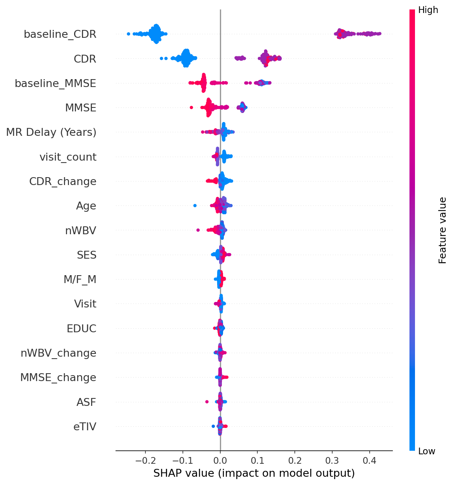

# NeuroRisk: Alzheimer's Progression Prediction

Classical machine learning (no deep learning) that predicts whether a patient is **Nondemented**, **Converted** or **Demented** from longitudinal MRI and cognitive data, with SHAP explanations and a Streamlit app.

## Data

[OASIS-2 longitudinal](https://www.oasis-brains.org/) (`data/oasis_longitudinal.csv`): 150 subjects, multiple visits each. Features include age, education, SES, MMSE, CDR, eTIV, nWBV and ASF.

## Pipeline (`src/pipeline.py`)

1. **Longitudinal features** (`src/preprocess.py`): per-visit change in MMSE, CDR and brain volume (nWBV), baseline MMSE/CDR, and visit count
2. **Preprocessing:** one-hot sex, KNN imputation (k=5), standard scaling
3. **SMOTE** class balancing, applied to training data only (imblearn `Pipeline`)
4. **Stacking ensemble:** XGBoost + Random Forest + RBF SVM, with a logistic-regression meta-learner (5-fold CV)
5. **Evaluation:** stratified 80/20 split, accuracy and classification report
6. **Explainability:** SHAP summary and single-patient waterfall plots



## Run it

```bash
pip install -r requirements.txt

cd src
python pipeline.py        # trains, saves outputs/model.pkl and SHAP plots
streamlit run app.py      # risk dashboard with PDF report export
```

`pipeline.py` uses paths relative to `src/`, so run it from there. `notebooks/data_analysis.ipynb` has the exploratory analysis.

## Stack

pandas · scikit-learn · imbalanced-learn · XGBoost · SHAP · Streamlit · Plotly · fpdf2

> Research and learning project only. Not a medical device, and not for clinical decisions.
